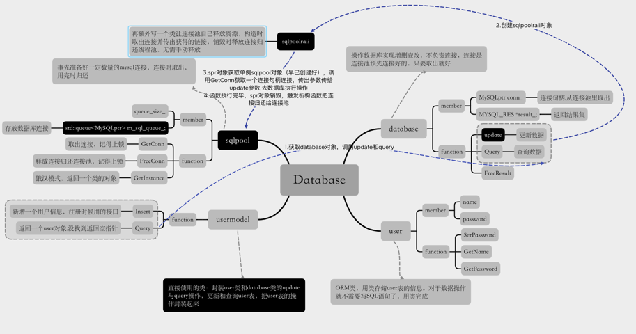

1. 使用单例模式确保该类只有一个对象，也就是只有一个数据库连接池。懒汉模式在判断是否存在对象时可能有多个线程同时判断从而创建多个，因此懒汉模式是线程不安全的采用饿汉模式，全局变量会在main函数之前初始化。
2. 饿汉模式创建出属于全局变量的对象，属于线程共享资源，所以需要时刻注意线程安全。
3. database:操作数据库实现增删查改，不负责连接，连接是连接池预先连接好的，只要取出就好
4. user:ORM类，用类存储user表的信息。对于数据操作就不需要写SQL语句了，用类完成
5. usermodel:直接使用的类：封装user类和database类的update与query操作，更新和查询user表，把user表的操作封装起来
6. sqlpool:事先准备好一定数量的mysql连接，连接时取出，用完时归还
7. sqlpoolraii:再额外写一个类让连接池自己释放资源，构造时取出连接并传出获得的链接，销毁时释放连接归还线程池，无需手动释放

